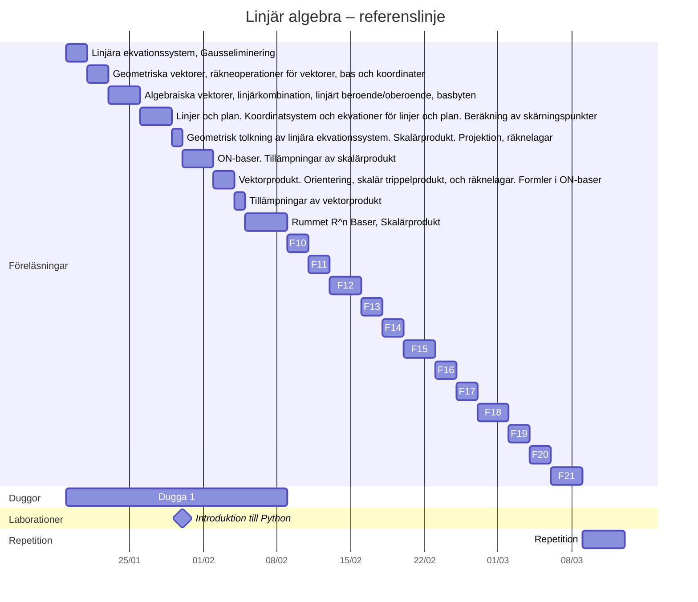

```mermaid
gantt
    dateFormat  YYYY-MM-DD
    title Linjär algebra – referenslinje
    axisFormat  %d/%m

    section Föreläsningar
    Linjära ekvationssystem, Gausseliminering: f1, 2026-01-19, 2026-01-21
    Geometriska vektorer, räkneoperationer för vektorer, bas och koordinater: f2, 2026-01-21, 2026-01-23
    Algebraiska vektorer, linjärkombination, linjärt beroende/oberoende, basbyten: f3, 2026-01-23, 2026-01-26
    Linjer och plan. Koordinatsystem och ekvationer för linjer och plan. Beräkning av skärningspunkter: f4, 2026-01-26, 2026-01-29
    Geometrisk tolkning av linjära ekvationssystem. Skalärprodukt. Projektion, räknelagar: f5, 2026-01-29, 2026-01-30
    ON-baser. Tillämpningar av skalärprodukt: f6, 2026-01-30, 2026-02-02
    Vektorprodukt. Orientering, skalär trippelprodukt, och räknelagar. Formler i ON-baser: f7, 2026-02-02, 2026-02-04
    Tillämpningar av vektorprodukt: f8, 2026-02-04, 2026-02-05
    Rummet R^n Baser, Skalärprodukt: f9, 2026-02-05, 2026-02-09
    F10: f10, 2026-02-09, 2026-02-11
    F11: f11, 2026-02-11, 2026-02-13
    F12: f12, 2026-02-13, 2026-02-16
    F13: f13, 2026-02-16, 2026-02-18
    F14: f14, 2026-02-18, 2026-02-20
    F15: f15, 2026-02-20, 2026-02-23
    F16: f16, 2026-02-23, 2026-02-25
    F17: f17, 2026-02-25, 2026-02-27
    F18: f18, 2026-02-27, 2026-03-02
    F19: f19, 2026-03-02, 2026-03-04
    F20: f20, 2026-03-04, 2026-03-06
    F21: f21, 2026-03-06, 2026-03-09

    section Duggor
    Dugga 1 : d1, 2026-01-19, 2026-02-09

    section Laborationer
    Introduktion till Python :milestone, l1, 2026-01-30, 2026-01-30

    section Repetition
    Repetition: r1, 2026-03-09, 2026-03-13
```
