```mermaid
gantt
    dateFormat  YYYY-MM-DD
    title Linjär algebra – referenslinje
    axisFormat  %d/%m

    section Kurslinje
    Linjära ekvationssystem, Gausseliminering: f1, 2026-01-19, 2026-01-21
    Geometriska vektorer, räkneoperationer, bas och koordinater: f2, 2026-01-21, 2026-01-23
    Algebraiska vektorer, linjärkombination, beroende/oberoende, basbyten: f3, 2026-01-23, 2026-01-26
    Linjer och plan – koordinatsystem och ekvationer, skärningspunkter: f4, 2026-01-26, 2026-01-29
    Geometrisk tolkning av linjära system, skalärprodukt, projektion: f5, 2026-01-29, 2026-01-30
    ON-baser och tillämpningar av skalärprodukt: f6, 2026-01-30, 2026-02-02
    Vektorprodukt, orientering, trippelprodukt: f7, 2026-02-02, 2026-02-04
    Tillämpningar av vektorprodukt: f8, 2026-02-04, 2026-02-05
    Rummet R^n, baser och skalärprodukt: f9, 2026-02-05, 2026-02-09
    Matriser och linjära ekvationssystem (F10): f10, 2026-02-09, 2026-02-11
    Transponat och invers matris (F11): f11, 2026-02-11, 2026-02-13
    Basbyten, ortogonala matriser, rang och nollrum (F12): f12, 2026-02-13, 2026-02-16
    Linjära avbildningar – projektion, spegling, rotation (F13): f13, 2026-02-16, 2026-02-18
    Isometrier och bijektiva avbildningar (F14): f14, 2026-02-18, 2026-02-20
    Basbyten vid linjära avbildningar (F15): f15, 2026-02-20, 2026-02-23
    Affina avbildningar och determinanter (F16): f16, 2026-02-23, 2026-02-25
    Determinanter forts., Cramers regel (F17): f17, 2026-02-25, 2026-02-27
    Huvudsatsen för kvadratiska matriser (F18): f18, 2026-02-27, 2026-03-02
    Egenvärden och egenvektorer (F19): f19, 2026-03-02, 2026-03-04
    Egenvärden forts., karakteristiska polynom (F20): f20, 2026-03-04, 2026-03-06
    Diagonalisering och repetition (F21): f21, 2026-03-06, 2026-03-09
    Repetition: r1, 2026-03-09, 2026-03-13

    section Duggor
    Dugga 1 : d1, 2026-01-19, 2026-02-09

    section Laborationer
    Introduktion till Python :milestone, l1, 2026-01-30, 0d

```

## Läsvecka 1
📅 2026-01-19 – 2026-01-23

### 📖 Läsning
- [x] Kapitel 1.1-1.3

### ✏️ Rekommenderade uppgifter
- [ ] 1.1
- [ ] 1.2
- [ ] 1.3
- [ ] 1.4
- [ ] 1.7
- [ ] 1.8
- [ ] 1.9
- [ ] 1.10
- [ ] 1.11
- [ ] 1.12
- [ ] 1.15
- [ ] 1.17
- [ ] 1.22
- [ ] 2.1
- [ ] 2.2
- [ ] 2.3
- [ ] 2.4
- [ ] 2.5
- [ ] 2.13
- [ ] 2.14
- [ ] 2.15
- [ ] 2.17
- [ ] 2.18ab

---
