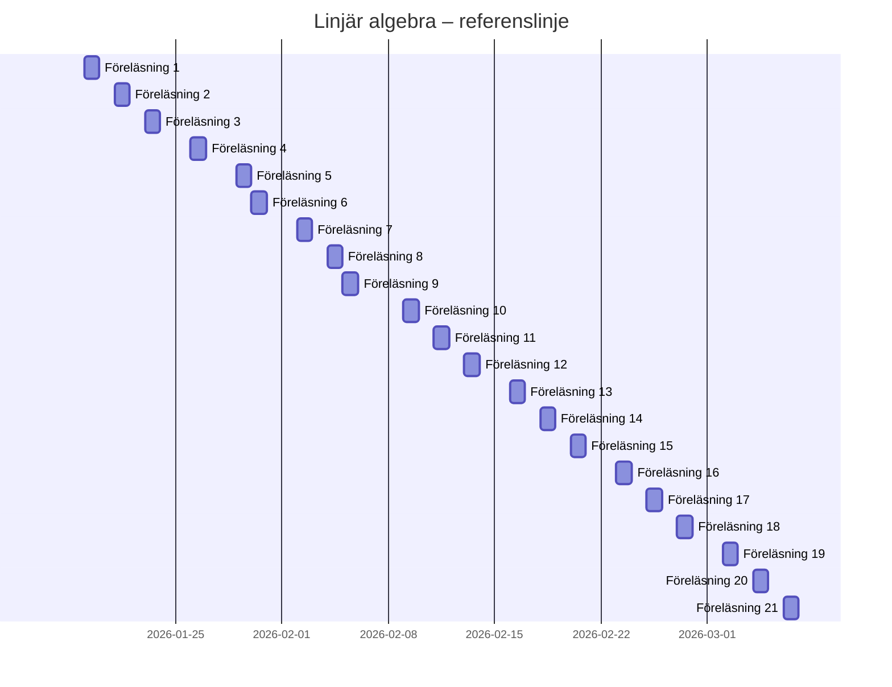

# Linjär algebra – Kurslinje

> Referenstidslinje enligt kursens schema.  
> Jag rör mig längs denna linje.  
> Avvikelse = synligt, inte ett misslyckande.

---

## 📊 Tidslinje (referens)

> 🔧 **Statusregel (manuell):**
> - Lägg till `:done,` framför ett datum när *alla checkboxar under datumet är klara*  
> - Lägg till `:active,` för dagens datum

---

## 📅 19/1 – Föreläsning 1
**Tema:** Linjära ekvationssystem, Gausseliminering  
**Avsnitt:** 1.1–1.3

- [x] Läs 1.1–1.3 ✅ 2026-01-21
- [ ] Uppgifter kap 1 (urval)

---

## 📅 21/1 – Föreläsning 2
**Tema:** Geometriska vektorer  
**Avsnitt:** 2.1–2.3

- [ ] Läs 2.1–2.3
- [ ] Uppgifter kap 2 (grund)

---

## 📅 23/1 – Föreläsning 3
**Tema:** Algebraiska vektorer  
**Avsnitt:** 2.4–2.5

- [ ] Läs 2.4–2.5
- [ ] Uppgifter kap 2 (forts.)

---

## 📅 26/1 – Föreläsning 4
**Tema:** Linjer och plan  
**Avsnitt:** 3.1–3.3

- [ ] Läs 3.1–3.3
- [ ] Uppgifter kap 3

---

## 🧪 Dugga 1
📅 19/1 – 9/2

- [ ] Repetera 19/1
- [ ] Repetera 21/1
- [ ] Repetera 23/1
