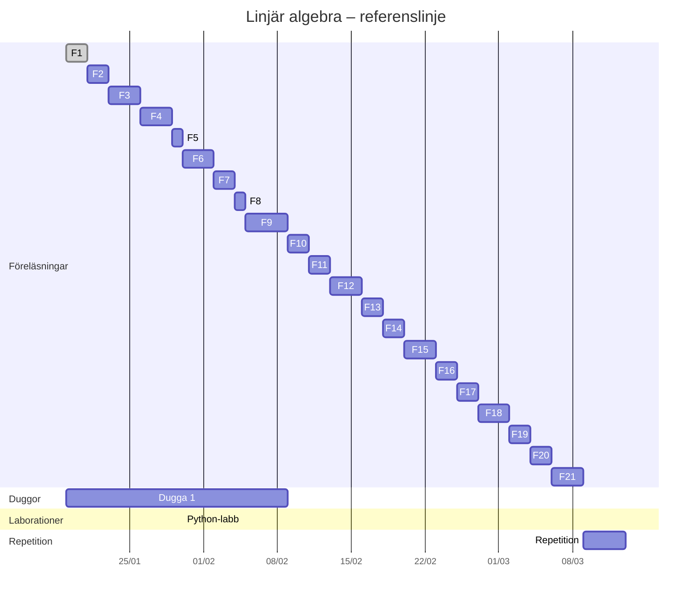
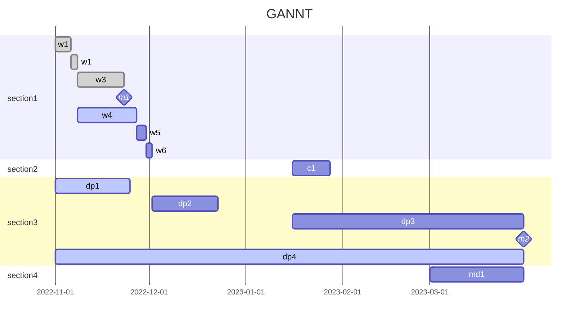

# Linjär algebra – Kurslinje

## 📊 Kursens tidslinje (Gantt)

```mermaid
gantt
    dateFormat  YYYY-MM-DD
    title Linjär algebra – referenslinje
    axisFormat  %d/%m

    section Föreläsningar
    F1 :done, f1, 2026-01-19, 2026-01-21
    F2: f2, 2026-01-21, 2026-01-23
    F3: f3, 2026-01-23, 2026-01-26
    F4: f4, 2026-01-26, 2026-01-29
    F5: f5, 2026-01-29, 2026-01-30
    F6: f6, 2026-01-30, 2026-02-02
    F7: f7, 2026-02-02, 2026-02-04
    F8: f8, 2026-02-04, 2026-02-05
    F9: f9, 2026-02-05, 2026-02-09
    F10: f10, 2026-02-09, 2026-02-11
    F11: f11, 2026-02-11, 2026-02-13
    F12: f12, 2026-02-13, 2026-02-16
    F13: f13, 2026-02-16, 2026-02-18
    F14: f14, 2026-02-18, 2026-02-20
    F15: f15, 2026-02-20, 2026-02-23
    F16: f16, 2026-02-23, 2026-02-25
    F17: f17, 2026-02-25, 2026-02-27
    F18: f18, 2026-02-27, 2026-03-02
    F19: f19, 2026-03-02, 2026-03-04
    F20: f20, 2026-03-04, 2026-03-06
    F21: f21, 2026-03-06, 2026-03-09

    section Duggor
    Dugga 1: d1, 2026-01-19, 2026-02-09

    section Laborationer
    Python-labb: l1, 2026-01-30, 2026-01-30

    section Repetition
    Repetition: r1, 2026-03-09, 2026-03-13
```

```mermaid
gantt
dateFormat  YYYY-MM-DD
title       GANNT

section section1
w1   :done, w1, 2022-11-01, 2022-11-06
w1   :done, w2, after w1, 2d
w3  :done, w3, after w2, 2022-11-23
m1 :milestone, m1, 2022-11-23 , 0d
w4 :active, w4, after w2, 2022-11-27
w5 :w5, after w4, 3d
w6 :w6, after w5, 2d

section section2
c1   :c1, 2023-01-16, 2023-01-28

section section3
dp1   :active, dp1, 2022-11-01, 2022-11-25
dp2   :dp2, after w6 dp1, 2022-12-23
dp3   :dp3, 2023-01-16, 2023-03-31
m2    :milestone, m2, 2023-03-31, 0d
dp4   :active, dp4, 2022-11-01, 2023-03-31

section section4
md1  :md1, 2023-03-01, 2023-03-31
```
