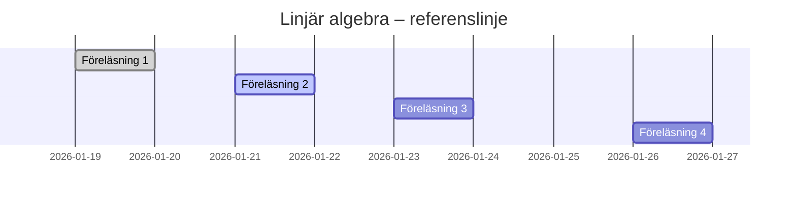

# Linjär algebra – Kurslinje

> Referenstidslinje enligt kursens schema.  
> Jag ligger antingen före, på eller efter denna linje.

---

## 📅 19/1 – Föreläsning 1
**Tema:** Linjära ekvationssystem, Gausseliminering  
**Avsnitt:** 1.1–1.3

- [ ] Läs 1.1–1.3
- [ ] Övningar kap 1 (urval)

---

## 📅 21/1 – Föreläsning 2
**Tema:** Geometriska vektorer  
**Avsnitt:** 2.1–2.3

- [ ] Läs 2.1–2.3
- [ ] Övningar kap 2 (grund)

---

## 📅 23/1 – Föreläsning 3
**Tema:** Algebraiska vektorer  
**Avsnitt:** 2.4–2.5

- [ ] Läs 2.4–2.5
- [ ] Övningar kap 2 (forts.)

---

## 📅 26/1 – Föreläsning 4
**Tema:** Linjer och plan  
**Avsnitt:** 3.1–3.3

- [ ] Läs 3.1–3.3
- [ ] Övningar kap 3

---

## 📊 Kursens tidslinje (Gantt)

