# Linjär algebra – Kurslinje

> Referenstidslinje enligt kursens schema.  
> Jag rör mig längs denna linje.  
> Avvikelse = synligt, inte ett misslyckande.

---

## 📊 Tidslinje (referens)

```mermaid
gantt
    dateFormat  YYYY-MM-DD
    title Linjär algebra – referenslinje

    Föreläsning 1  : f1, 2026-01-19, 1d
    Föreläsning 2  : f2, 2026-01-21, 1d
    Föreläsning 3  : f3, 2026-01-23, 1d
    Föreläsning 4  : f4, 2026-01-26, 1d
    Föreläsning 5  : f5, 2026-01-29, 1d
    Föreläsning 6  : f6, 2026-01-30, 1d
    Föreläsning 7  : f7, 2026-02-02, 1d
    Föreläsning 8  : f8, 2026-02-04, 1d
    Föreläsning 9  : f9, 2026-02-05, 1d
    Föreläsning 10 : f10, 2026-02-09, 1d
    Föreläsning 11 : f11, 2026-02-11, 1d
    Föreläsning 12 : f12, 2026-02-13, 1d
    Föreläsning 13 : f13, 2026-02-16, 1d
    Föreläsning 14 : f14, 2026-02-18, 1d
    Föreläsning 15 : f15, 2026-02-20, 1d
    Föreläsning 16 : f16, 2026-02-23, 1d
    Föreläsning 17 : f17, 2026-02-25, 1d
    Föreläsning 18 : f18, 2026-02-27, 1d
    Föreläsning 19 : f19, 2026-03-02, 1d
    Föreläsning 20 : f20, 2026-03-04, 1d
    Föreläsning 21 : f21, 2026-03-06, 1d
```

> 🔧 **Statusregel (manuell):**
> - Lägg till `:done,` framför ett datum när *alla checkboxar under datumet är klara*  
> - Lägg till `:active,` för dagens datum

---

## 📅 19/1 – Föreläsning 1
**Tema:** Linjära ekvationssystem, Gausseliminering  
**Avsnitt:** 1.1–1.3

- [x] Läs 1.1–1.3 ✅ 2026-01-21
- [ ] Uppgifter kap 1 (urval)

---

## 📅 21/1 – Föreläsning 2
**Tema:** Geometriska vektorer  
**Avsnitt:** 2.1–2.3

- [ ] Läs 2.1–2.3
- [ ] Uppgifter kap 2 (grund)

---

## 📅 23/1 – Föreläsning 3
**Tema:** Algebraiska vektorer  
**Avsnitt:** 2.4–2.5

- [ ] Läs 2.4–2.5
- [ ] Uppgifter kap 2 (forts.)

---

## 📅 26/1 – Föreläsning 4
**Tema:** Linjer och plan  
**Avsnitt:** 3.1–3.3

- [ ] Läs 3.1–3.3
- [ ] Uppgifter kap 3

---

## 🧪 Dugga 1
📅 19/1 – 9/2

- [ ] Repetera 19/1
- [ ] Repetera 21/1
- [ ] Repetera 23/1
