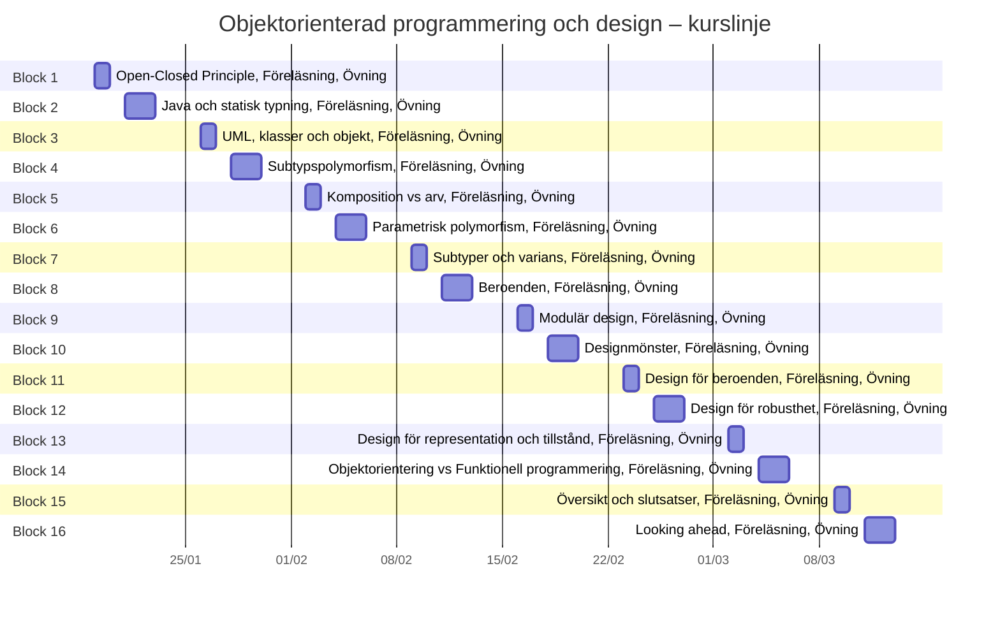

## Block 1
📅 2026-01-19 – 2026-01-20

### 📖 Läsning
- [ ] 1
- [ ] 2.0–2.1
- [ ] 4.9–4.11
- [ ] 5.4
- [ ] 5.7
- [ ] Appendix B

### ✏️ Rekommenderade uppgifter
- [ ] Övningsmaterial: DrawPolygons.java, DrawPolygons.py, https://github.com/oopd-gu-chalmers/block01exercise
- [ ] Övning 1: OOPD

---

## Block 2
📅 2026-01-21 – 2026-01-23

### 📖 Läsning
- [ ] 2.2–2.3
- [ ] 2.5–2.7

### ✏️ Rekommenderade uppgifter
- [ ] Övningsmaterial: https://github.com/oopd-gu-chalmers/block02exercise
- [ ] Övning 2: Syntax och Semantik

---

## Block 3
📅 2026-01-26 – 2026-01-27

### 📖 Läsning
- [ ] 2.4
- [ ] 3.5
- [ ] Appendix A

### ✏️ Rekommenderade uppgifter
- [ ] Övning 3: UML, static vs dynamic

---

## Block 4
📅 2026-01-28 – 2026-01-30

### 📖 Läsning
- [ ] 2.8–2.11

### ✏️ Rekommenderade uppgifter
- [ ] Övning 4: Overriding vs Overloading

---

## Block 5
📅 2026-02-02 – 2026-02-03

### 📖 Läsning
- [ ] 3

### ✏️ Rekommenderade uppgifter
- [ ] Övning 5: Subklassning vs Composition

---

## Block 6
📅 2026-02-04 – 2026-02-06

### 📖 Läsning
- [ ] Java Generics (tutorials point)

### ✏️ Rekommenderade uppgifter
- [ ] Övning 6: Generic Type Declarations

---

## Block 7
📅 2026-02-09 – 2026-02-10

### 📖 Läsning
- [ ] Type Dependency in Java Part 1
- [ ] Type Dependency in Java Part 2

### ✏️ Rekommenderade uppgifter
- [ ] Övning 7: Subtyping och Variance

---

## Block 8
📅 2026-02-11 – 2026-02-13

### 📖 Läsning
- [ ] 5.1–5.2
- [ ] 5.8

### ✏️ Rekommenderade uppgifter
- [ ] Övning 8: High Cohesion, Low Coupling

---

## Block 9
📅 2026-02-16 – 2026-02-17

### 📖 Läsning
- [ ] 4.0–4.3
- [ ] 5.3–5.5
- [ ] 5.7

### ✏️ Rekommenderade uppgifter
- [ ] Övning 9: Separation of Concern

---

## Block 10
📅 2026-02-18 – 2026-02-20

### 📖 Läsning
- [ ] 7.0
- [ ] 8.7

### ✏️ Rekommenderade uppgifter
- [ ] Övning 10: Enkla designmönster

---

## Block 11
📅 2026-02-23 – 2026-02-24

### 📖 Läsning
- [ ] 8.0–8.4

### ✏️ Rekommenderade uppgifter
- [ ] Övning 11: Model-View-Controller

---

## Block 12
📅 2026-02-25 – 2026-02-27

### 📖 Läsning
- [ ] 5.6
- [ ] 7.2
- [ ] 8.6

### ✏️ Rekommenderade uppgifter
- [ ] Övning 12: Mutability

---

## Block 13
📅 2026-03-02 – 2026-03-03

### 📖 Läsning
- [ ] 4.4–4.6

### ✏️ Rekommenderade uppgifter
- [ ] Övning 13: Representation

---

## Block 14
📅 2026-03-04 – 2026-03-06

### 📖 Läsning
- [ ] Algebraic Data Types vs Object Hierarchies
- [ ] Lambda expressions i Java

### ✏️ Rekommenderade uppgifter
- [ ] Övning 14: Funktioner

---

## Block 15
📅 2026-03-09 – 2026-03-10

### ✏️ Rekommenderade uppgifter
- [ ] Övning 15: Ännu fler Design Patterns

---

## Block 16
📅 2026-03-11 – 2026-03-13

### ✏️ Rekommenderade uppgifter
- [ ] Övning 16: Retrospektiv och tentamen

---

## Självstudier

- [ ] Självstudiematerial (Git, Javadoc, JUnit)

---

## Licens

 Detta kursinnehåll är tillgängligt under en **[CC attribution non-commercial](http://creativecommons.org/licenses/by-nc/4.0)** licens. Innehåll i kursen kan anses omfattas av denna licens om inget annat anges.
